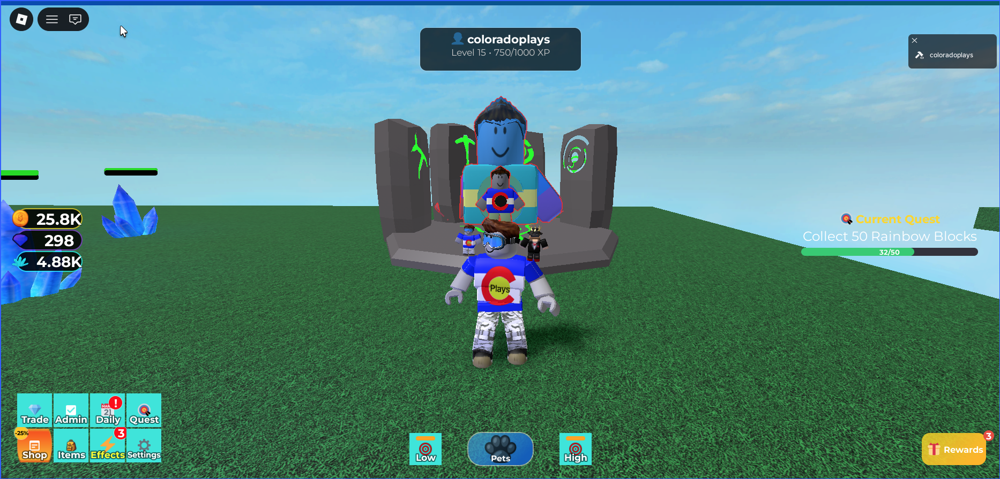

# RBX Template

A configuration-as-code Roblox pet/clicker template built with Rojo. The project is designed so code owns reusable game systems and Studio/world builders own map geometry, art, and invisible gameplay markers.



## Current Checkpoint

Phase 5 has its first server-authoritative auto systems slice. The pet follow/mining feel refactor is intentionally deferred until hands-on playtesting.

- Phase 0: foundations complete.
- Phase 1: map integration contract complete for synthetic and partial authored maps.
- Phase 2: economy depth complete for the current baseline.
- Phase 3: stats-derived wins complete: pet index, achievements, and live leaderboards.
- Phase 4: progression depth complete for the current baseline: unique pet XP/levels, enchant-slot unlock milestones, hatch-time enchant rolls, manual reroll service hooks, enchant modifier providers, player-level team power, configurable level rewards, eternal/huge pet handling, source-of-truth pet power, and offline balance tooling.
- Phase 5: auto-system slice active: server-selected auto-target modes, persisted auto settings, server-enforced hatch auto-delete filters, and first dynamic egg hatch foundation.

## Current Implemented Features

The playable baseline currently includes:

- Rojo-owned code/config with Studio-owned map geometry and marker hooks.
- Persistent ProfileStore-backed player data after Studio API access is enabled.
- Breakable crystal spawning, coin spawning, contribution rewards, and configurable reward modifiers.
- Eggs, proximity hatch validation, server-authoritative dynamic `1..99` requested hatch counts, and hatching from configured pet asset ids.
- Mixed pet inventory storage: normal pets stack, special pets are unique records.
- Pet equip limits, storage limits, config-driven upgrades, and admin test controls.
- Imported pet asset transforms for scale, orientation, Huge scale, and variant visuals.
- Centralized pet grants through `PetGrantService`, including huge serial allocation and hatcher provenance.
- Eternal/Huge pet power handling with config-only durable pet power.
- Unique-pet XP, levels, enchant-slot unlock milestones, and hover-time XP display refresh.
- Configurable player-level team power and level milestone rewards, starting with extra equipped pet slots.
- Hatch-time enchants, server-authoritative manual rerolls, and a map-authored enchanter station.
- Live enchant consumers for breakable rewards, pet XP, hatch luck, secret hatch luck, pet damage, team power, and pet efficiency.
- Enchanter VFX using a reusable ColorfulClickers-style lightning module plus station-configured endpoints.
- Enchanter UI descriptions/reveal copy sourced from enchant config.
- Paid area unlocks, locked-gate prompts/notices, and server-authoritative portal/pad travel.
- Active-zone breakable spawning so inactive areas stay dormant until entered.
- Pet index milestones, achievements, and live leaderboard service over shared stats.
- Config-driven auto-target modes: nearest, highest value, weakest, strongest, and selected currency.
- Config-driven hatch auto-delete filters by rarity, pet family, and variant, with protected special rarities.
- Hatch panel controls and hotkeys for selected-count, max, and auto hatch, backed by the same server batch endpoint and server-validated auto entitlement/session handling.
- Compact hatch auto-delete filter drawer for rarity, pet-family, and variant filters, backed by the server-authoritative auto-delete settings event.
- Hatch mode toggles for Golden/Fast/Skip/Silent; Golden mode is server-entitlement checked, explains locked access, costs the configured multiplier, and prevents basic variants.
- Admin panel tools and Studio MCP smoke-test tooling for repeatable validation.

## In Process / Partially Implemented

These systems exist but still need polish or later-phase expansion:

- Player-level and enchant balance values are intentionally first-pass and need tuning from real playtesting.
- Pet follow/mining still runs through a stabilized legacy cloned script. Phase 4 now routes its damage/cadence through the modifier pipeline, but a cleaner PetWork/Combat service should replace that script.
- Enchanter UI works and now explains config descriptions, but richer player education such as signs/help panels is still future polish.
- Auto systems currently have server/config/smoke coverage and compatibility with the existing Low/High buttons; richer settings UI controls are still future polish.
- Egg hatching now has the server transaction foundation and a first-pass near-egg Hatch/Max/Auto panel, but the UI still needs visual QA and broader player education around settings/filter behavior.
- Egg hatch responses include authored egg visual metadata and `EggHatchingService` has a first-pass authored ViewportFrame clone/scale path, but the animation still needs richer UI polish.
- Offline balance tooling reads the current player-level curve, but it remains a rough calculator rather than a full economy simulator.
- Authored-map workflow works through markers, but visible production map fixtures/gate art are still early.

## Planned Features

Planned or intentionally deferred work:

- Potions, boosts, shops, and other player enhancements that feed the shared modifier pipeline.
- Richer auto-system UI controls and player-facing explanations.
- Richer egg UI polish: locked-mode explanations, responsive layout QA, special reveal presentation, and fuller player-facing hatch education.
- Daily gifts, reward tracks, codes, stock/limited items, and Pet of the Day style rotations.
- Chaseables, seasonal/event currencies, and more authored-world content.
- Trading/marketplace with Roblox-native escrow and anti-duplication guarantees.
- Automated Meshi-to-Roblox asset workflow.
- Pet follow/mining refactor into a service-owned assignment, cadence, and damage system.
- Rebirth only if it becomes rare and dramatic; it is deferred out of Phase 4.
- No generic stack-to-unique promotion flow for normal pets; pets needing per-copy state should be unique from grant/craft/reward time.

## Configuration As Code

Most gameplay tuning lives in `configs/*.lua`. Designers should be able to add or rebalance content by editing configs and Studio markers instead of writing service code.

Important configs:

- `configs/game.lua`: feature flags and global settings.
- `configs/pets.lua`: pet families, rarity, variant multipliers, asset ids, transforms, eternal settings, and enchant capacity.
- `configs/pet_progression.lua`: unique-pet XP curves, level caps, power growth, and enchant-slot unlocks.
- `configs/player_progression.lua`: player-level team-power scaling and level reward milestones.
- `configs/enchants.lua`: enchant effects, rarity roll profiles, roll counts, chance weights, strength ranges, reroll costs, and modifier mappings.
- `configs/auto_systems.lua`: auto-target modes, default auto settings, and hatch auto-delete filter rules.
- `configs/areas.lua`: zone tree and area unlock requirements.
- `configs/markers.lua`: Studio-authored map marker contract.
- `configs/breakables.lua`: crystals, spawn tables, and world/area spawner settings.
- `configs/upgrades.lua`: permanent player upgrades.
- `configs/pet_index.lua`, `configs/achievements.lua`, `configs/leaderboards.lua`: Phase 3 stats-derived systems.

Durable pet power has a single source of truth in `configs/pets.lua`: family base power plus variant multipliers. Saved pet inventory records should store identity and mutable per-copy state such as level, XP, enchants, serials, hatcher metadata, lock state, and Huge/Eternal traits, but not power values.

Enchant chance and behavior also have a single source of truth in `configs/enchants.lua`. Services read configured rarity profiles, weighted chance entries, slot counts, strength ranges, and modifier mappings; saved pets store only the rolled enchant identity/strength. Changing what `scholar`, `crystal_finder`, or any future enchant does should not require editing pet records or pet configs.

## AI And Wiki Workflow

This repo is intended to be developed with Codex or another AI coding agent. The persistent project memory lives in `docs/wiki/`, so useful decisions survive beyond one chat thread and future agents can move quickly without rediscovering the same context.

Recommended start-of-work flow for any agent:

1. Read `AGENTS.md`.
2. Read `docs/wiki/INDEX.md`.
3. Follow the links relevant to the task, especially `CURRENT_STATUS.md`, `DECISIONS.md`, `ARCHITECTURE.md`, `STUDIO_WORKFLOW.md`, and `MAP_INTEGRATION_CONTRACT.md`.
4. Verify the wiki against source files before editing code, because code and formal requirements remain the final authority.
5. Make the smallest useful code/config/doc change.
6. Run the relevant local checks and Studio smoke runners.
7. Update the wiki before finishing if the work changed architecture, config shape, map contracts, data shapes, save fields, network packets, Studio workflow, or project direction.

The wiki pattern is deliberately lightweight:

- `docs/wiki/INDEX.md` is the table of contents.
- `docs/wiki/CURRENT_STATUS.md` says what is true right now.
- `docs/wiki/DECISIONS.md` captures durable decisions and rationale.
- `docs/wiki/ARCHITECTURE.md` explains service and data boundaries.
- `docs/wiki/STUDIO_WORKFLOW.md` captures Rojo, Studio, MCP, and smoke-test workflow.
- `docs/wiki/LOG.md` records dated session summaries.
- `docs/wiki/raw/` is for unsynthesized notes; do not treat raw notes as current truth until they are compiled into a normal wiki page.

Use `python3 scripts/wiki_status.py` as a quick health check after wiki edits. The goal is not heavy documentation; the goal is a short, current project memory that lets an AI agent and a human developer maintain momentum together.

## Studio And Rojo Workflow

Prerequisites:

- Roblox Studio.
- Rojo 7.6.1 or newer.
- `mise` for local tool versions.

Common commands:

```bash
mise exec -- rojo serve --port 34872
mise exec -- rojo build --output /tmp/rbx-template.rbxl
mise exec -- selene configs src tests --allow-warnings
python3 scripts/wiki_status.py
python3 scripts/balance_team_power.py --list-pets
```

In Roblox Studio:

1. Open the place.
2. Connect the Rojo plugin to `localhost:34872`.
3. Start Play mode for datastore/API-dependent tests.
4. Keep Studio API access enabled when testing persistence.

Useful Studio command-bar runners after Rojo sync:

```lua
return require(game:GetService("ReplicatedStorage").Tests.studio.GrantColoradoTestPets).runText()
return require(game:GetService("ReplicatedStorage").Tests.studio.BackfillPetHatcherProvenance).runText()
return require(game:GetService("ReplicatedStorage").Tests.studio.BackfillPetPowerSourceOfTruth).runText()
return require(game:GetService("ReplicatedStorage").Tests.studio.EternalPowerSmoke).runText()
return require(game:GetService("ReplicatedStorage").Tests.studio.Phase4PetProgressionSmoke).runText()
return require(game:GetService("ReplicatedStorage").Tests.studio.Phase5AutoSystemsSmoke).runText()
return require(game:GetService("ReplicatedStorage").Tests.studio.EggBatchHatchSmoke).runText()
```

## Project Structure

```text
configs/                  Gameplay and system configuration
docs/                     Requirements, implementation plan, and reference docs
docs/wiki/                Persistent LLM-maintained project memory
scripts/                  Local tools and Studio helper scripts
src/Client/               Client UI and local systems
src/Server/               Server services and Studio smoke bridge
src/Shared/               Shared config loader, network signals, and utilities
tests/studio/             Studio command-bar/MCP smoke runners
tests/unit/               Unit specs for config and service behavior
```

## Verification Baseline

Latest local checkpoint:

- `rojo build`: passes.
- `selene configs src tests --allow-warnings`: passes with existing warnings.
- `python3 scripts/wiki_status.py`: passes.
- `git diff --check`: passes.
- Phase 3 Studio smoke coverage exists for pet index, achievements, leaderboards, and Phase 2 regressions.
- `Phase4PetProgressionSmoke`: passes in Studio for hatch enchants, breakable XP, manual reroll, player-level slot rewards, hatch/secret luck, pet damage, team power, pet efficiency, and profile restoration.
- `Phase5AutoSystemsSmoke`: passes in Studio for server-selected nearest/highest/weakest/strongest/selected-currency targets, hatch auto-delete filters, protected special rarity behavior, and profile restoration.
- `EggBatchHatchSmoke`: added for server batch hatch count/cost behavior, rapid-repeat hatch lock rejection, partial hatch by available funds/storage, locked Auto/Golden mode rejection, and Golden mode cost/no-basic behavior.
- `EggProximitySmoke`: now also checks the near-egg hatch panel appears with Hatch/Max/Auto/count controls.

See `docs/wiki/CURRENT_STATUS.md` for detailed verification history and `docs/IMPLEMENTATION_PLAN.md` for the phase roadmap.

## Next Work

The next big hands-on lane is replacing the legacy pet follow/mining script with a service-owned PetWork/Combat loop. That should wait for play-feel testing; smaller MCP-friendly work can continue around settings UI, auto-system polish, and docs.
