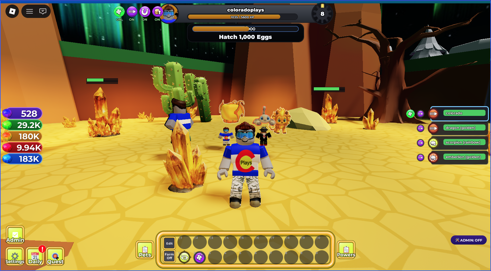

# Pet Realm — *Halo & Horns*

A config-as-code Roblox pet game built with Rojo. You mine biome ore, hatch and grow a squad of pets, fight alongside them with a City-of-Heroes–style power kit, and push outward through a ring of biomes toward a heaven/hell realm axis. Code owns the reusable game systems; Studio and world builders own map geometry, art, and invisible gameplay markers.

The project started as a generic pet/clicker template and **is now the game itself** (the repo *is* Pet Realm) — the template baseline survives underneath as the foundation layer.



## The Core Loop

**Mine biome ore → earn that biome's coins → hatch eggs → grow & equip a pet squad → claim levels (powers, slots, egg-hatch) → fight & conquer → unlock the next zone** — ringing outward toward the heaven/hell realm endgame.

Pets are the stars: each has a two-number profile (⛏ mining vs ⚔ combat), an origin element, and a role (tank/melee/blaster/support). You build *you* through archetypes, a pick-10 power roster, and slotted enhancements; your pets carry the fight.

## Current Checkpoint

The game is built in two stacked tracks, both well past their core milestones, with an active polish/content lane on top.

**Template baseline — Phases 0–11 complete** (the config-as-code foundation):
- P0 data spine · P1 map integration contract · P2 economy depth · P3 stats/achievements/leaderboards · P4 progression & enchants · P5 auto-systems · …through P11 the SSOT pet-inventory model.

**Halo & Horns game build — Phases 0–10 complete** (the heaven/hell pet game on top of the baseline):
- **P0 Data spine** — ring topology, Soul alignment, themed per-biome currencies.
- **P1 Pets & power** — element resonance, the multiplicative power formula, element-at-hatch.
- **P2 Heaven vertical slice** — layer access/portals + Heaven reward scaling (logic).
- **P3 Pet party core** — Spirit Form, the stacked-pet token-bucket pool, the active-squad hierarchy.
- **P4 Combat & focus** — enemy spawners, auto-target, loot, the no-HP player Focus model.
- **P5 Build depth** — archetypes, level-up power selection, augmentation slots + set bonuses, hotbar, rosters.
- **P6 Social/endgame** — party scaling, escrow trade, chaotic fusion, chaos rifts.
- **P7–P10** — reward spine (quests/daily/shop), achievements→spine, unified player level, two-player escrow trade UI.

**Active game lane — Pet Realm progression, power, economy & balance.** Per-biome zone economy, mining/combat balance, the PetPower mining/combat split, a level-50 XP-everywhere system with a claimed-vs-earned split + Ascension Altar, a level-diff accuracy curve, a bounded "pets-are-stars" power model with a Creator ceiling, the full powers/icons + enhancements systems, a CoH-style squad HUD and matching enemy HUD, a tutorial + early mission chain, orthogonal Huges, and Storage v2. All bound to the pinned design spec (`docs/PET_REALM_PROGRESSION_POWER_TEAMING.md` + `docs/PET_REALM_DESIGN_DOCUMENT.md`).

## Implemented Features

**World & economy**
- Ring of biomes (Earth → Ice → Lava → Desert), each with its own non-tradeable coin currency; the HUD shows all four with a live `+N` gain indicator.
- `ZoneTrackerService` resolves the current area by raycasting biome baseplates; farming is scoped to the area you're standing in, and inactive zones stay dormant until entered.
- Mining income identity `coins/sec = DPS × (value/HP)` (fixed 0.2 ratio) so every crystal tier pays the same rate — bigger nodes just take longer. Active mining (clicking a node) amplifies pet damage on it.
- Zone unlocks paid in the *prior* zone's coins (no skipping), tuned to a real chapter per zone.
- Per-biome egg stands placing real hatch-target eggs; server-authoritative travel via teleport pads / portals.

**Pets, power & progression**
- Mixed SSOT inventory: common pets compress into enchant-keyed stacks; Secret/Exclusive/Huge are unique records. 500-entry cap with effective-max including equip slots, storage telemetry, and stack enchant badges.
- PetPower mining/combat split (role aptitude × element × variant) shown on each card, with a bounded geometric tier curve and a code-enforced power ceiling (the Creator apex).
- **Eternal pets** (Huge/Secret/Exclusive) scale dynamically off the average of your top non-eternal pets, so they stay relevant forever without breaking the ceiling.
- Two-stage hatching (species, then basic/golden/rainbow), hatch-time enchants, hatch-luck curve with a radically-boosted first hatch, auto-delete filters, and an authored hatch-reveal animation.
- **Orthogonal Huges:** any pet can roll Huge, with a global census index and a world-first realm announcement.
- XP from **both** mining and combat feeds a level-50 track. **Claimed-vs-earned split:** XP earns levels; powers/slots/egg-hatch are *claimed* through a level-up sequence UI. Hybrid **Ascension Altar** — filler levels auto-claim in the field, milestone levels train at the altar. Caps: 10 equipped pets + 10 power picks.

**Combat & powers**
- Pet-squad combat: server-owned perception/aggro (tanks pull, hurt enemies retaliate), Spirit-Form down/recovery with per-pet + slot lockouts, and a slowed 10× HP world tuned for engaging multi-second fights.
- Archetypes + a pick-10-of-many power roster: damage, defense, heal, buffs/debuffs (which apply to **farming** crystals too, not just enemies), travel/utility (Swift, Hasten, Revive, Recall), and per-origin signature powers including summon capstones.
- Slotted **enhancements** (origin-keyed cogs) that modify power stats, with drops, an inventory surface, a slotting UI, and an in-slot result preview.
- Unified, programmatic **icon/badge system**: a colored origin disc + white effect symbol + targeting ring, generated from an asset manifest (no hand-typed ids), driving the hotbar, squad cards, and world VFX from one registry.
- Additive **BuffStack** model (same-axis buffs add, never compound), config-driven combat VFX, and a shared-world FX broadcast so nearby players see your combat/mining numbers and power effects.

**HUD & UX**
- CoH-style **squad HUD** (right edge): one card per pet — element/role chip, health bar, status-buff badges, recharge/lockout timers, click-to-select assist targeting.
- Matching **enemy HUD** (left edge): the foes aggro'd onto your squad, with the indirect target (selected pet → enemy) bordered — built from the same shared `HudCard` chrome.
- Center player bar (XP pill + level ring + level-up arrow), area-themed tray/currency/quest panels, a buff-stats readout (effective attack/defense/coin/luck multipliers), floating coin payouts, daily-streak / shop / quest panels, and a viewport-relative mobile scale pass.
- A **tutorial** (objective capsule + egg beacon + UI pulse) and an early ordered **mission chain**, with derived power tooltips.
- A boot loader / loading screen that gates play until data is ready and stamps the build version + Mountain-Time update timestamp.

**Foundation (template baseline)**
- ProfileStore-backed persistence with schema versioning and migrations; a stat-counter + modifier-pipeline + currency-ledger spine; deterministic UTC day/seed; feature flags.
- `ConfigLoader` validates every config at startup, with focused validators for core gameplay configs.
- Achievements, a pet index, and live leaderboards over shared stats; permanent upgrades; admin tooling and Studio MCP smoke-test bridges.

## In Process / Planned

- **World S3** — the heaven/hell realm axis as a *non-terminal* endgame (token earning loop, traversal-sink knob, depth-as-desirability via Eternal pets) rather than a dead-end ring terminus.
- **Teaming S4** — guest pass + lead-anchored sidekick/exemplar (power axis only).
- **Creator S5** — Creator class (dev-only, untradeable apex) + Meet-the-Creator + shiny pets.
- Earning-rate enemy pressure (anti-cheat), support-pet targeted buff/debuff, PetPower display=dealt, a Power S2b balance rebase, and an overnight memory-leak investigation.
- Authored realm geometry + portals (art) for the stacked heaven/hell layers; enhancement trading + natural-conversion sink; a full mobile-input audit; ongoing balance tuning from real playtesting.

## Configuration As Code

Most gameplay tuning lives in `configs/*.lua` — designers add or rebalance content by editing configs and Studio markers, not service code. Selected configs:

- `game.lua` — feature flags and global settings.
- `biomes.lua`, `areas.lua`, `currencies.lua`, `zone_tracker.lua` — the biome ring, zone tree/unlocks, themed coins, area resolution.
- `pets.lua`, `pet_power.lua`, `pet_roles.lua`, `pet_progression.lua`, `level_track.lua` — pet families/rarity/variants/transforms, the mining/combat power model, role aptitudes, XP curves, the claimed-vs-earned level track.
- `powers.lua`, `archetypes.lua`, `augmentation.lua`, `hotbar.lua`, `enhancements.lua`, `buffs.lua` — the power roster, archetypes, slots/set-bonuses, hotbar, enhancement cogs, additive buff stacking.
- `power_icons.lua` / `power_icons_assets.lua` (generated), `combat_fx.lua`, `power_fx.lua` — the icon/badge registry and combat/power VFX.
- `enemies.lua`, `combat.lua`, `focus.lua`, `spirit_form.lua`, `squad.lua`, `stack_pool.lua` — combat, the no-HP Focus model, Spirit Form, the squad/stack-pool math.
- `egg_system.lua`, `enchants.lua`, `auto_systems.lua`, `drops.lua`, `gems.lua` — hatching, enchants, auto-target/auto-delete, drops & gems.
- `soul.lua`, `layers.lua`, `elements.lua`, `theme_utility.lua` — Soul alignment, heaven/hell layers, element resonance.
- `rewards.lua`, `quests.lua`, `daily.lua`, `shop.lua`, `trade.lua`, `fusion.lua`, `rifts.lua`, `party.lua` — the reward spine and social/endgame systems.

Durable pet power has a single source of truth in `configs/pets.lua` + `pet_power.lua` (family/role/element/variant), never persisted per copy. Enchant and enhancement behavior likewise live in config; saved pets store only rolled identity/strength.

## AI & Wiki Workflow

This repo is developed with AI coding agents. Persistent project memory lives in `docs/wiki/` so decisions survive beyond one chat thread. Recommended start-of-work flow:

1. Read `AGENTS.md`.
2. Read `docs/wiki/INDEX.md`, then follow links relevant to the task — especially `CURRENT_STATUS.md`, `DECISIONS.md`, `ARCHITECTURE.md`, and `STUDIO_WORKFLOW.md`.
3. Verify the wiki against source before editing code; code and the pinned design specs are the final authority.
4. Make the smallest useful change, run the local checks (`mise run ci`) and any relevant Studio smokes, and update the wiki if the change touched architecture, config shape, data/save shapes, network packets, map contracts, Studio workflow, or direction.

Wiki map: `INDEX.md` (contents) · `CURRENT_STATUS.md` (what's true now) · `DECISIONS.md` (durable decisions) · `ARCHITECTURE.md` (service/data boundaries) · `STUDIO_WORKFLOW.md` (Rojo/Studio/MCP) · `LOG.md` (dated sessions) · `raw/` (unsynthesized notes). The game design SoT lives in `docs/PET_REALM_*.md`. Run `python3 scripts/wiki_status.py` as a health check after wiki edits.

## Studio & Rojo Workflow

Prerequisites: Roblox Studio · Rojo 7.6.1+ · `mise` for tool versions.

```bash
mise exec -- rojo serve            # sync to Studio (Rojo plugin → localhost)
mise run ci                        # fast gate: selene + StyLua (owned paths) + rojo build + headless tests
mise run test-headless             # pure-logic specs only (lune)
mise run stamp                     # stamp build_info.lua (git + Mountain Time) before publishing
python3 scripts/wiki_status.py     # wiki health check
```

In Studio: open the place, connect the Rojo plugin, start Play for datastore/API-dependent tests, and keep Studio API access enabled when testing persistence. Live verification beyond headless uses the Studio MCP (read Output, capture screenshots, start/stop play, execute Luau, drive the real UI) plus the server-side `AutomationSuite` and the `Phase*Smoke` / game smoke runners.

## Project Structure

```text
configs/                  Gameplay and system configuration (config-as-code)
docs/                     Requirements, design specs (PET_REALM_*), and reference docs
docs/wiki/                Persistent LLM-maintained project memory
scripts/                  Local tools, asset pipeline, and Studio helpers
src/Client/               Client UI, HUD systems, and local controllers
src/Server/               Server services and the Studio smoke/automation bridges
src/Shared/               Pure game logic, config loader, network signals, the command bus
tests/headless/           Headless pure-logic specs (lune)
tests/studio/             Studio command-bar / MCP smoke runners
```

## Automation API & Remote Dev Pipeline

The game can be developed, tested, and released from a CLI/AI agent without GUI clicking, by driving it through a command boundary and the Studio MCP.

- **Command boundary** (`src/Shared/API/CommandBus.lua`) — a pure dispatcher every gameplay action flows through; the GUI, network layer, and tests are different callers of the same commands. `GameAPIService` owns the bus behind one `GameAPICommand` RemoteFunction (untrusted clients can never reach test-only commands).
- **Headless tests** — `mise run test-headless` runs pure-logic specs (lune) with no Studio.
- **Fast gate / CI** — `mise run ci` (selene + StyLua on owned paths + `rojo build` + headless) runs locally and in GitHub Actions on every push.
- **Studio integration** — `AutomationService` (Studio-only) drives pathfinding movement, state snapshot/restore, and assertions; `RunAutomationSuite` runs the server-side suite via the MCP.
- **Release** — `mise run release` publishes via Open Cloud `rojo upload`; secrets read from env only (`DRY_RUN=1` validates).

Testing methodology (the pyramid): **pure logic → server-side command-bus integration (primary, state-based) → thin UI sanity with screenshots.** State proves; pixels confirm. See `docs/wiki/REMOTE_DEV_PIPELINE.md` and `docs/wiki/AUTOMATION_API_DESIGN.md`.

## Verification Baseline

- `mise run ci` (fast gate): green — selene 0 errors, StyLua clean on owned paths, `rojo build` passes, **headless 837/837 across 76 specs**. GitHub Actions runs the same gate on every push.
- Live in *Halo & Horns* (Rojo connected): the server-side `AutomationSuite` covers the alignment chain, pets/power/element resonance, layer access, party core (Spirit Form / stack pool / squad), combat & focus, and the Phase-5 build-depth systems. Studio `Phase*Smoke` + game smoke runners cover the egg system, progression, and zone/economy paths.
- Game-layer features (combat, HUD, powers, enhancements, tutorial) are iterated live in Studio play sessions and verified through the MCP + in-session play.

See `docs/wiki/CURRENT_STATUS.md` for detailed verification history and `docs/PET_REALM_IMPLEMENTATION_PLAN.md` for the game roadmap.

## Next Work

The active lane is the **Pet Realm game layer**: the heaven/hell realm axis as a non-terminal endgame (World S3), teaming (S4), the Creator apex (S5), earning-rate enemy pressure, and ongoing combat/economy balance from real playtesting. Authored realm geometry/art and the legacy pet-follow service refactor are the parked map/foundation lanes.
